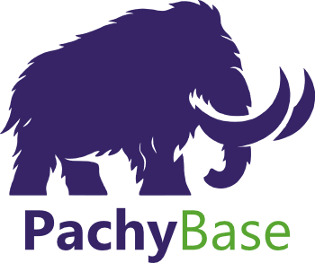

# PachyBase

<p align="center">
  
</p>

# PachyBase

PachyBase is an open-source, self-hosted backend foundation built with PHP, focused on predictable JSON APIs, modular architecture, and simple local development through Docker.

The project is designed for developers who want more control over their backend stack, infrastructure, and deployment flow without depending on external BaaS platforms.

## Highlights

- API-first approach
- Predictable JSON response structure
- Modular and extensible architecture
- Self-hosted and Docker-ready
- Support for different database drivers
- PHP 8+ oriented structure
- Clean and maintainable codebase

## Standard API Response

All responses should follow the project standard:

```json
{
  "success": true,
  "data": {},
  "meta": {
    "contract_version": "1.0",
    "request_id": "b0bb2f930d4b4f5ab9e2d1f7b74b9df6",
    "timestamp": "2026-03-11T03:00:00+00:00",
    "path": "/",
    "method": "GET"
  },
  "error": null
}
```

Error responses keep the same outer structure:

```json
{
  "success": false,
  "data": null,
  "meta": {
    "contract_version": "1.0",
    "request_id": "b0bb2f930d4b4f5ab9e2d1f7b74b9df6",
    "timestamp": "2026-03-11T03:00:00+00:00",
    "path": "/users",
    "method": "POST"
  },
  "error": {
    "code": "VALIDATION_ERROR",
    "type": "validation_error",
    "message": "The request payload is invalid.",
    "details": [
      {
        "field": "email",
        "code": "required",
        "message": "The email field is required."
      }
    ]
  }
}
```

### Contract goals

- `success` is always a boolean.
- `data` always exists, even when `null`.
- `meta` always exists and carries machine-readable request context.
- `error` is always `null` on success or a fixed object on failure.
- The API never mixes plain text, HTML, and JSON for different failure modes.

### Official contract conventions

- Required metadata: `meta.request_id`, `meta.timestamp`, `meta.method`, and `meta.path`.
- Pagination responses expose `meta.pagination.total`, `per_page`, `current_page`, `last_page`, `from`, and `to`.
- Validation failures use HTTP `422`, `error.code = "VALIDATION_ERROR"`, `error.type = "validation_error"`, and `error.details` as a list of field objects shaped like `field`, `code`, and `message`.
- Authentication failures use HTTP `401` and `error.type = "authentication_error"` for missing, invalid, or expired credentials.
- Authorization failures use HTTP `403` and `error.type = "authorization_error"` when the caller is authenticated but lacks permission.
- New endpoints must return through `core/Http/ApiResponse.php`; controllers and middleware should not build JSON payloads manually.
- Runtime layers outside `core/Http/ApiResponse.php` must not emit raw HTTP output directly.

### Current implementation

- [`public/index.php`](./public/index.php) delegates bootstrap and HTTP dispatch to the modular kernel.
- [`config/Bootstrap.php`](./config/Bootstrap.php) loads environment configuration and registers the error handler.
- [`api/HttpKernel.php`](./api/HttpKernel.php) captures the request, loads the route map, and dispatches the router.
- [`routes/api.php`](./routes/api.php) centralizes API route registration.
- [`modules/Auth/AuthModule.php`](./modules/Auth/AuthModule.php) registers the auth routes under `/api/auth`.
- [`modules/Crud/CrudModule.php`](./modules/Crud/CrudModule.php) registers the automatic CRUD routes under `/api/{entity}`.
- [`config/CrudEntities.php`](./config/CrudEntities.php) centralizes declarative CRUD exposure, field policy, pagination limits, and lightweight hooks per entity.
- [`modules/System/SystemModule.php`](./modules/System/SystemModule.php) registers the system module routes.
- [`api/Controllers/AuthController.php`](./api/Controllers/AuthController.php) exposes login, refresh, revoke, profile, and API token endpoints.
- [`api/Controllers/CrudController.php`](./api/Controllers/CrudController.php) handles the generic CRUD HTTP surface.
- [`api/Controllers/SystemController.php`](./api/Controllers/SystemController.php) orchestrates the HTTP endpoint.
- [`auth/AuthService.php`](./auth/AuthService.php) centralizes JWT, API token, refresh session, and revocation flows.
- [`auth/AuthorizationService.php`](./auth/AuthorizationService.php) applies scope-based authorization with deny-by-default behavior.
- [`services/Crud/EntityCrudService.php`](./services/Crud/EntityCrudService.php) converts entity metadata into automatic list, read, create, update, and delete flows.
- [`services/Crud/EntityCrudValidator.php`](./services/Crud/EntityCrudValidator.php) centralizes typed validation, field rules, and structured validation errors.
- [`services/SystemStatusService.php`](./services/SystemStatusService.php) contains the reusable status business flow.
- [`database/`](./database) now provides the reusable persistence layer, including connection, adapters, schema inspection, type normalization, and safe query execution.
- [`database/Metadata/EntityIntrospector.php`](./database/Metadata/EntityIntrospector.php) transforms raw table schema into stable entity metadata for the core.
- [`core/Http/Router.php`](./core/Http/Router.php) provides a simple and fast routing engine.
- [`core/Http/Request.php`](./core/Http/Request.php) abstracts incoming HTTP requests safely.
- [`core/Http/ApiResponse.php`](./core/Http/ApiResponse.php) is the single response formatter.
- [`core/Http/ErrorHandler.php`](./core/Http/ErrorHandler.php) converts PHP errors and exceptions into the same API structure.
- [`docs-site/docs/api-contract.md`](./docs-site/docs/api-contract.md) is the canonical public contract specification.

## Architecture

The project now uses real application layers:

- `api/`: HTTP kernel and controllers.
- `auth/`: authentication services and middleware.
- `database/`: database connection and persistence infrastructure.
- `modules/`: domain-oriented route composition.
- `services/`: reusable business flows.
- `utils/`: shared utility helpers.
- `config/`: bootstrap and environment-backed configuration.
- `routes/`: route map entrypoints.

`core/Http/` remains the shared HTTP infrastructure layer that powers routing, request abstraction, response formatting, and error handling.

## Database Layer

The persistence layer now supports a reusable adapter model for MySQL and PostgreSQL, plus an entity metadata bridge for automatic CRUD:

- `database/Adapters/DatabaseAdapterInterface.php` defines the common adapter contract.
- `database/Adapters/MySqlAdapter.php` isolates MySQL schema inspection.
- `database/Adapters/PostgresAdapter.php` isolates PostgreSQL schema inspection.
- `database/Schema/SchemaInspector.php` reads tables, columns, primary keys, indexes, and relations through one API.
- `database/Schema/TypeNormalizer.php` maps vendor-specific types into a stable internal representation.
- `database/Metadata/EntityDefinition.php` represents a table as a core-readable entity definition.
- `database/Metadata/FieldDefinition.php` represents normalized field metadata including required, readonly, nullable, and default information.
- `database/Metadata/EntityIntrospector.php` transforms raw schema into entity metadata and caches definitions during the current runtime.
- `database/Query/PdoQueryExecutor.php` centralizes parameterized query execution and transactions.
- `database/Migrations/` now centralizes migration loading, tracking, and execution across both drivers.
- `database/Seeds/` now centralizes seed loading, tracking, and execution across both drivers.

This is the foundation for automatic CRUD generation without scattering engine-specific SQL across the project.

### Entity metadata

Phase 4 introduces the semantic layer between raw schema and the core:

- entity names are derived from table names with stable conventions such as `pb_system_settings` -> `system_setting`
- field metadata now identifies:
  - primary field
  - required fields
  - readonly fields
  - normalized types
  - nullable state
  - default values
- metadata is cached in-memory per runtime to avoid repeated table mapping work inside the same request or CLI execution

Example:

```php
use PachyBase\Database\AdapterFactory;
use PachyBase\Database\Metadata\EntityIntrospector;
use PachyBase\Database\Schema\SchemaInspector;

$introspector = new EntityIntrospector(new SchemaInspector(AdapterFactory::make()));
$entity = $introspector->inspectTable('pb_system_settings');

echo $entity->name; // system_setting
echo $entity->primaryField; // id
```

### Database migrations

PachyBase now includes a lightweight migration layer built on top of the same database adapter/query foundation:

- `database/Migrations/MigrationInterface.php` defines the migration contract.
- `database/Migrations/AbstractSqlMigration.php` helps create driver-aware SQL migrations.
- `database/Migrations/FilesystemMigrationLoader.php` loads migration files from `database/migration-files/`.
- `database/Migrations/MigrationRepository.php` tracks executed migrations in `pachybase_migrations`.
- `database/Migrations/MigrationRunner.php` applies, inspects, and rolls back migration batches.
- `database/Schema/SystemTableBlueprint.php` standardizes the base schema conventions for PachyBase system tables.

### Database seeds and bootstrap

PachyBase now includes a minimum seed layer and an automated database bootstrap flow:

- `database/Seeds/SeederInterface.php` defines the seed contract.
- `database/Seeds/FilesystemSeedLoader.php` loads seed files from `database/seed-files/`.
- `database/Seeds/SeedRepository.php` tracks executed seeds in `pachybase_seeders`.
- `database/Seeds/SeedRunner.php` runs idempotent seed batches.
- `scripts/seed.php` exposes seed `status` and `run`.
- `scripts/bootstrap-database.php` waits for the database, runs migrations, and applies seeds.

The default Phase 3 bootstrap creates these base tables:

- `pachybase_migrations`
- `pachybase_seeders`
- `pb_system_settings`
- `pb_api_tokens`
- `pb_users`
- `pb_auth_sessions`

Use the CLI helper or Composer scripts:

```bash
php scripts/migrate.php status
php scripts/migrate.php up
php scripts/migrate.php down
php scripts/seed.php status
php scripts/seed.php run
php scripts/bootstrap-database.php
```

```bash
composer migrations:status
composer migrate
composer migrations:rollback
composer db:seed:status
composer db:seed
composer db:bootstrap
```

## Routing and Controllers

Routes are registered in `routes/api.php` and composed through modules such as `modules/System/SystemModule.php`.
Controllers live under the `api/Controllers/` namespace and stay thin by delegating behavior to services.

## Automatic CRUD

Phase 5 introduces automatic CRUD generation for enabled entities. Phase 8 makes that generation declarative and controllable through [`config/CrudEntities.php`](./config/CrudEntities.php). The default runtime enables:

- `/api/system-settings`
- `/api/api-tokens`

For each enabled entity, PachyBase now exposes:

- `GET /api/{entity}`
- `GET /api/{entity}/{id}`
- `POST /api/{entity}`
- `PUT /api/{entity}/{id}`
- `PATCH /api/{entity}/{id}`
- `DELETE /api/{entity}/{id}`

The automatic CRUD layer supports:

- pagination through `page` and `per_page`
- simple filters through `filter[field]=value`
- sorting through `sort=field` or `sort=-field`
- basic search through `search=term`
- bearer-protected access through JWT or API tokens
- deny-by-default authorization through entity and action scopes
- structured `404`, `409`, `422`, and `500` responses through the same API contract

The entity config layer now lets the developer adjust behavior without rewriting the core:

- expose or hide an entity from the public CRUD surface
- disable delete for sensitive entities
- whitelist writable fields
- hide fields from serialized responses
- cap `per_page` per entity
- mark additional fields as readonly
- declare extra validation rules per field
- attach lightweight hooks such as `before_create`, `before_update`, `after_create`, `after_show`, and `after_delete`

## Input Validation

Phase 6 strengthens the automatic CRUD layer with a central validation engine connected to entity metadata and field rules.

The validation layer now supports:

- required and nullable handling
- type validation for boolean, integer, float, json, uuid, date, time, and datetime fields
- field-level `min` and `max`
- `enum`
- `email`
- `url`
- operation-aware validation for create, replace, and patch
- structured `422` responses with `field`, `code`, and `message`

Validation rules are declared per enabled entity in [`config/CrudEntities.php`](./config/CrudEntities.php) and combined with metadata from `database/Metadata/`.

## Authentication and Authorization

Phase 7 adds a hybrid auth layer that protects runtime endpoints without inflating the core.

The current auth surface includes:

- `POST /api/auth/login`
- `POST /api/auth/refresh`
- `POST /api/auth/revoke`
- `GET /api/auth/me`
- `POST /api/auth/tokens`
- `DELETE /api/auth/tokens/{id}`

The current runtime supports:

- API token authentication for server-to-server and automation flows
- JWT access tokens for user-facing clients
- refresh token rotation through `pb_auth_sessions`
- route protection through `auth/Middleware/RequireBearerToken.php`
- scope-based authorization for CRUD entity actions and auth token management
- structured `401` and `403` responses through the same JSON contract

CRUD endpoints now require a bearer credential and authorize each action against scopes such as:

- `crud:read`
- `crud:create`
- `crud:update`
- `crud:delete`
- `entity:system-settings:read`
- `entity:system-settings:update`
- wildcard grants like `entity:system-settings:*` and `*`

The local bootstrap also seeds a default admin user for development:

- email: `admin@pachybase.local`
- password: `pachybase123`

Override these values through environment variables before running `composer db:bootstrap`:

- `AUTH_JWT_SECRET`
- `AUTH_JWT_ISSUER`
- `AUTH_ACCESS_TTL_MINUTES`
- `AUTH_REFRESH_TTL_DAYS`
- `AUTH_BOOTSTRAP_ADMIN_EMAIL`
- `AUTH_BOOTSTRAP_ADMIN_PASSWORD`
- `AUTH_BOOTSTRAP_ADMIN_NAME`

Examples:

```bash
curl -X POST http://localhost:8080/api/auth/login \
  --data-urlencode email=admin@pachybase.local \
  --data-urlencode password=pachybase123

curl http://localhost:8080/api/auth/me \
  -H "Authorization: Bearer <access-token>"

curl -X POST http://localhost:8080/api/auth/tokens \
  -H "Authorization: Bearer <access-token>" \
  --data-urlencode name="Deploy Token" \
  --data-urlencode "scopes[0]=entity:system-settings:read"
```

## Automatic OpenAPI

Phase 9 adds automatic OpenAPI generation with a live document at `/openapi.json`.

The specification is generated from the real runtime surface:

- registered routes from `routes/api.php`
- auth requirements enforced by middleware
- CRUD exposure declared in `config/CrudEntities.php`
- database metadata introspected from the actual tables
- request validation rules already applied by the services

The current document includes:

- fixed endpoints such as `/`, `/api/auth/*`, and `/openapi.json`
- CRUD endpoints expanded per exposed entity, such as `/api/system-settings` and `/api/api-tokens`
- request and response schemas
- error envelopes
- bearer authentication documentation
- grouping by tags

This improves exploration, SDK generation, and machine integrations without relying on a separate manual contract.

Example:

```bash
curl http://localhost:8080/openapi.json
```

Example:

```bash
curl "http://localhost:8080/api/system-settings?per_page=2&sort=setting_key"
curl "http://localhost:8080/api/system-settings?filter[is_public]=1"
curl "http://localhost:8080/api/system-settings?search=app"
curl -X POST http://localhost:8080/api/system-settings -H "Content-Type: application/json" -d "{\"setting_key\":\"ab\",\"value_type\":\"unknown\"}"
```

Example:

```php
use PachyBase\Api\Controllers\SystemController;
use PachyBase\Http\Router;

return static function (Router $router): void {
    $router->get('/status', [SystemController::class, 'status']);
};
```

And your Controller method receives the abstracted `Request` object:

```php
namespace PachyBase\Api\Controllers;

use PachyBase\Http\Request;
use PachyBase\Http\ApiResponse;
use PachyBase\Services\SystemStatusService;

final class SystemController
{
    public function __construct(
        private readonly ?SystemStatusService $statusService = null
    ) {
    }

    public function status(Request $request): void
    {
        $service = $this->statusService ?? new SystemStatusService();

        ApiResponse::success(
            $service->buildStatusPayload($request),
            ['resource' => 'system.status']
        );
    }
}
```

## Testing

When PHP and Composer are only available inside Docker, you can validate the modular architecture with:

```bash
docker compose -f docker/docker-compose.yml run --rm php composer dump-autoload
docker compose -f docker/docker-compose.yml run --rm php vendor/bin/phpunit --testdox
```

For contract smoke tests of the running API:

```bash
docker compose -f docker/docker-compose.yml up -d
curl http://localhost:8080/
curl http://localhost:8080/missing
curl -X POST http://localhost:8080/
curl "http://localhost:8080/api/system-settings?per_page=2&sort=setting_key"
curl -X POST http://localhost:8080/api/system-settings -H "Content-Type: application/json" -d "{\"setting_key\":\"sample.key\",\"setting_value\":\"Sample\",\"value_type\":\"string\",\"is_public\":true}"
docker compose -f docker/docker-compose.yml exec php php scripts/inspect-schema.php
docker compose -f docker/docker-compose.yml exec php php scripts/inspect-entities.php
docker compose -f docker/docker-compose.yml exec php php scripts/migrate.php status
docker compose -f docker/docker-compose.yml exec php php scripts/seed.php status
docker compose -f docker/docker-compose.yml exec php php scripts/bootstrap-database.php
```

## Installation

PachyBase only requires Docker and Docker Compose on the host machine. Composer runs inside the PHP container during setup.

Before installation, create [`.env`](./.env) from [`.env.example`](./.env.example) and fill in the database settings. This step is mandatory because `DB_DRIVER` defines which database container will be generated in `docker/docker-compose.yml`. The supported drivers are `mysql` and `pgsql`:

```env
DB_DRIVER=mysql
DB_HOST=db
DB_PORT=3306
DB_DATABASE=pachybase
DB_USERNAME=root
DB_PASSWORD=root
```

Example:

```bash
cp .env.example .env
```

### Windows

After configuring `.env`, run this from PowerShell or Command Prompt in the project root:

```bash
.\install.bat
```

### Linux

After configuring `.env`, run this from a shell in the project root:

```bash
chmod +x install.sh
./install.sh
```

Both installers perform these steps:
1. Validate Docker and Docker Compose availability.
2. Read the database settings from `.env`.
3. Generate `docker/docker-compose.yml` from the database settings.
4. Build the PHP image with Composer available inside Docker.
5. Run `composer install` inside the PHP container.
6. Start the containers with `docker compose up -d`.
7. Wait for the database, run migrations, and apply the default seeds automatically.

After installation, you can manage the stack with:

```bash
docker compose -f docker/docker-compose.yml up -d
docker compose -f docker/docker-compose.yml down
docker compose -f docker/docker-compose.yml logs -f
```

Once running, PachyBase is accessible at **`http://localhost:8080`**.

To rebuild the local environment from scratch without manual database work:

```bash
docker compose -f docker/docker-compose.yml down -v
./install.sh
```

On Windows, replace the last line with:

```bash
.\install.bat
```


